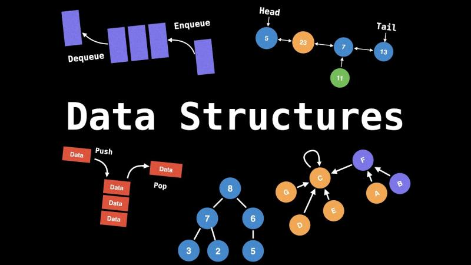

# Data Structures & Algorithms (DSA)

Collection of coding problems & solutions solved on LeetCode using Python, Java & C++.

| # | Problem | Difficulty |Pyhton Solution | Java Solution|C++ Solution|
|---|---------|------------|----------|----------|----------|
1 | [Two Sum](https://leetcode.com/problems/two-sum) | Easy | [Python](./LeetCode/Python/TwoSum.py)|[Java](#)|[C++](#)
